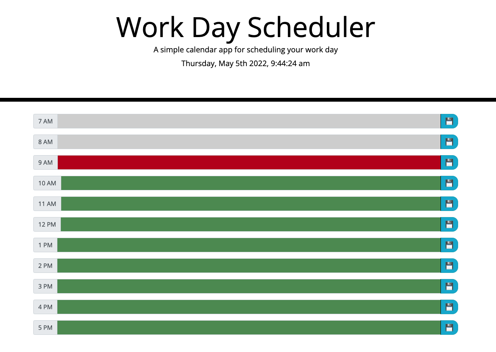

# Day-Planner

## Description
A simple calendar application that allows a user to schedule the work for each day during 7am to 5pm. 

## How to use the application
WHEN you open the planner, you can use the daily planner to create a schedule for the current day;
WHEN you click into a timeblock, each timeblock is color coded to indicate whether it is in the past, present, or future;
WHEN you click the save button for that timeblock, you can save the event which you entered, the event can be saved persist unless you clear the local storage;
WHEN you refresh the page, you can see the saved event for that timeblock;

## Live Link
 https://jean424.github.io/Day-Planner/
 
